<div align="center">

# 📦 App in a Box

**Idea to clickable prototype to production iOS and Android app, with Claude Code or Codex**

A free, open-source plugin for Claude Code and Codex. A product advisor shapes your idea, you click through a prototype of every screen, then your agent builds and wires an Expo + FastAPI + Supabase app with auth, analytics, CI, store builds and an agent harness.

[Quickstart](#quickstart) · [What you get](#what-you-get) · [How it works](#how-it-works) · [Guides](#guides) · [Status](#status) · [FAQ](#faq) · [Showcase](SHOWCASE.md)

   

</div>

---

Standing up a *real* app from scratch is mostly plumbing. You need auth, a database
with row-level security, an API, analytics, crash reporting, CI, a design system,
environment variables for three deploy targets, and a way to make your coding agent
behave like a disciplined team instead of a very fast intern.

App in a Box does that plumbing for you, then gets out of the way. You talk about your
idea however it comes out; a product advisor plays it back, asks only what's missing
and checks the market while you talk. You click through a prototype of every screen
and tune it. Then it walks you through a few "Continue with GitHub" signups,
scaffolds, provisions and wires everything, and hands you a repo where your agent
builds features through a spec → tests → PR → review loop.

It was extracted from a real production app (an AI strength-coaching app), with the
app-specific parts taken out. The guards and recipes exist because that app shipped
the bugs they now catch.

## Quickstart

Open an **empty folder**, then pick your agent.

### Claude Code

```
/plugin marketplace add foxinthehenhouse/app-in-a-box
```

```
/plugin install app-in-a-box@app-in-a-box
```

```
/app-in-a-box:new-app
```

### Codex

```
codex plugin marketplace add foxinthehenhouse/app-in-a-box
```

```
codex plugin add app-in-a-box@app-in-a-box
```

```
codex -c sandbox_workspace_write.network_access=true "Use \$new-app to build my app idea here."
```

### Any other agent (no plugin)

Clone this repo and paste this prompt into any agent that can read files and run a shell:

```
Read <clone>/plugins/app-in-a-box/skills/new-app/SKILL.md and follow it
exactly. KIT is <clone>/plugins/app-in-a-box. Build my app in the current folder.
```

> **Fewer approval prompts:** run `claude --permission-mode auto`, or
> `codex --approve-for-me`. For full bypass, use the bundled dev container. See
> [permissions](plugins/app-in-a-box/docs/PERMISSIONS.md).

Full walkthrough: **[START_HERE.md](START_HERE.md)**.

## What you get

A repo that's ready to ship on day one, not a starter you'll spend a week hardening.

| | |
|---|---|
| **📱 Mobile app** | Expo Router native tabs (Liquid Glass on iOS 26, Material 3 on Android) and form-sheet routes, email-code sign-in behind an auth gate, light + dark themes from your tokens, and a component library with a dev-only gallery. Production pieces are built in and tested: offline-first data (TanStack Query, queued edits), push client, deep links through one resolver, OTA updates, react-hook-form + zod forms, i18n with a pseudo-locale test, account deletion and "Download my data". PostHog analytics (typed events, masked replay, opt-out) and Sentry. A demo mode runs the whole app with no accounts. |
| **⚙️ Backend** | FastAPI with Supabase JWT auth (JWKS). A `/health` that names every unconfigured feature instead of failing silently, error ids on every 500, PII-scrubbed Sentry, and an example resource that's correctly scoped to the user, with ownership tests. |
| **🗄️ Database** | Supabase Postgres migrations with row-level security on every table, a profile-on-signup trigger, and a keep-alive for the free tier. |
| **🎨 Design** | A clickable prototype of every v1 screen that looks finished on the first render: a lit atmosphere derived from your palette, real device chrome, spring-driven screen transitions and a reduced-motion version. Switch between three design directions, layout variants per screen, density, motion, atmosphere (light, grain, glass) and copy tone. The frozen version becomes `design/tokens.json` + `docs/product/SCREENS.md`, and a WCAG contrast gate rejects unreadable palettes before any code exists. |
| **🛡️ Guards** | Git hooks that bind every agent and human: no commits on `main`, no staged `.env`, no key-shaped strings, gates before push. Mobile guard scripts: every screen instrumented, every env var wired for shipping builds, replay never unmasked. Harness lints: every PR names its ticket, product skills ask the owner instead of deciding, and `AGENTS.md`'s map of screens, APIs and tables can't drift from the code. |
| **🔁 CI/CD** | Backend (ruff + pyright + import-linter architecture boundaries + pytest), mobile (tsc + eslint with boundary rules + guards + jest), migrations linted with squawk (no locking or breaking statements), applied and RLS-tested with pgTAP on a throwaway Postgres, and diffed against a committed schema snapshot (Supabase Branching opt-in), gitleaks + CodeQL, workflow lint (actionlint + zizmor) and harness lint for prompts/hooks, AI PR review (Claude or Codex), EAS build/OTA workflows, scheduled jobs behind a secret, a Supabase keep-alive, and nightly age-encrypted database backups with a restore drill. |
| **🤖 Agent harness** | `AGENTS.md` (Claude reads it via `CLAUDE.md`). 15 skills: backlog, next, feature-discovery, build-feature, pr-review, land, new-worktree, ship, incident, north-star-report, market-watch, routines, reflect, harness-optimize, harness-check. 10 subagent roles on routed models, with a `chair` for irreversible calls. Path rules that inject when you touch migrations, API contracts or screens. A git-tracked memory vault. |
| **🧠 Self-learning loop** | Every tool call is captured. `reflect` turns corrections into memory, and a pattern extractor mines transcripts for repeated failures. `harness-optimize` then proposes harness changes as a PR, with a protected-components manifest and a sunset protocol. |

### One harness, two agents

Everything agent-facing lives in one neutral place. The Claude and Codex folders are
generated from it, so the two never drift.

| | Source of truth | Claude Code | Codex |
|---|---|---|---|
| Instructions | `AGENTS.md` | `CLAUDE.md` → `@AGENTS.md` | native |
| Skills | `.agents/skills/` | `.claude/skills` (symlink) · `/name` | native · `$name` |
| Subagents | `.agents/agents/*.md` | `.claude/agents` (symlink) | `.codex/agents/*.toml` |
| MCP servers | `.mcp.json` | native | `.codex/config.toml` |
| Hooks | `.claude/hooks/*` | `.claude/settings.json` | `.codex/hooks.json` |
| Hard guards | `.githooks/` | ✓ | ✓ |

## How it works

```mermaid
flowchart LR
  A[0 · Preflight] --> B[1a · Shape<br/>1b · idea check alongside]
  B --> C[2 · Prototype<br/>click it → tokens + screens]
  C --> D[3 · Accounts<br/>you click, it logs in]
  D --> E[4 · Scaffold<br/>render + shape to brief]
  E --> F[5 · Provision<br/>Supabase · EAS · Railway<br/>PostHog · Sentry · GitHub]
  F --> G[6 · Harness<br/>guards on + smoke test]
  G --> H[7 · Verify<br/>gates · /health · first event]
  H --> I[8 · First feature<br/>spec → PR → review]
```



| Phase | Your agent does | You do |
|---|---|---|
| 0 Preflight | Checks and installs git, Node, Python 3.12 and the service CLIs | Approve installs |
| 1a Shape | Rae, your product advisor, lets you ramble (or paste notes), plays it back in one page, asks only what's missing and gently challenges what might not work. Writes the brief | Talk; answer a few questions |
| 1b Idea check | Runs in the background while you talk: competitors, real complaints, what people pay. A cited Go / Sharpen / Rethink verdict | Read it; carry on, sharpen or park |
| 2 Prototype | A team of design agents builds a clickable prototype of every screen. Switch the look, each screen's layout, minimal↔rich, calm↔playful, the atmosphere and optional features, then freeze the one you love | Click, tune, approve |
| 3 Accounts | Opens each free service's signup, then logs in the CLIs | Click "Continue with GitHub" ~6× |
| 4 Scaffold | Creates the Expo app, overlays the template, and shapes the data model, API and screens to your brief | Nothing |
| 5 Provision | Creates cloud resources idempotently and wires every secret (never into git), then the ops defaults: an uptime monitor on `/health`, nightly encrypted backups, and a spend-cap checklist | Nothing |
| 6 Harness | Turns on the git guards, branch protection and AI review, then proves each guard fires | Trust the project in Codex |
| 7 Verify | All gates green, `/health`, first PR, plus the first analytics event and first error for the services you chose | Open the app on your phone |
| 8 First feature | Seeds a backlog and builds feature #1 through the full loop | Review the PR |

Stop at any phase. Progress lives in `appbox.yaml`, and re-running `new-app` resumes
where you left off.

### Accounts

Every service has a free tier, except Apple ($99/yr, and only when you ship to
TestFlight). The kit deliberately **never creates accounts for you**, because signups
need your consent, email verification and often a CAPTCHA. It automates everything
*after* the account exists.

GitHub · Supabase · Expo/EAS · Railway (about $5/mo after the trial) · PostHog ·
Sentry · optionally Linear, Anthropic/OpenAI · Apple Developer.

## Guides

Each one answers a single question, start to finish.

- [Build an iPhone and Android app with Claude Code](docs/guides/build-an-app-with-claude-code.md)
- [Build an iPhone and Android app with Codex](docs/guides/build-an-app-with-codex.md)
- [Turn an app idea into a clickable prototype before writing code](docs/guides/idea-to-clickable-prototype.md)
- [What's in the generated repo, and why](docs/guides/what-you-get.md)
- [Ship to TestFlight and Google Play](docs/guides/ship-to-testflight-and-google-play.md)
- [Add payments, AI, push, offline and social sign-in](docs/guides/add-payments-ai-push-offline-social-sign-in.md)

Release notes: [CHANGELOG.md](CHANGELOG.md). For LLMs and tools: [llms.txt](llms.txt).

## Repository layout

```
.claude-plugin/marketplace.json      marketplace: read by Claude Code AND Codex
plugins/app-in-a-box/
  .claude-plugin/plugin.json         Claude Code manifest
  .codex-plugin/plugin.json          Codex manifest (same skills/)
  .mcp.json                          MCP servers used while provisioning
  skills/                            the phases: new-app (start here), doctor, shape,
                                     validate-idea, prototype, accounts, scaffold,
                                     provision, harness, first-feature; references:
                                     interview (question bank), design-directions;
                                     recipe-* add-ons
  agents/                            the shaping + prototype team (Rae and 8 helpers)
  evals/                             `claude plugin eval` cases for the kit's own skills
  scripts/render.py                  deterministic renderer + Claude/Codex adapter generator
  scripts/prototype.py               prototype.json → check / render / freeze
  scripts/check_contrast.py          WCAG gate for design/tokens.json
  scripts/doctor.sh                  tools / logins / gates health check
  template/                          everything that lands in your new repo, including
                                     .agents/skills (land drives a PR to merged)
  docs/                              COST, MODEL_ROUTING, PERMISSIONS, PRODUCTION,
                                     SOCIAL_AUTH, TASTE, TROUBLESHOOTING
scripts/fixtures/                    test-only inputs for the selftest (not example apps)
scripts/selftest.sh                  proves the kit works (see below)
scripts/selftest.d/                  one check file per area, sourced by the selftest
scripts/check_discoverability.py     manifests, README and llms.txt describe the kit
                                     the same way, and every doc link resolves
docs/guides/                         one page per question (see Guides above)
llms.txt                             a map of these docs for LLMs (llmstxt.org)
```

## Verify it yourself

```
scripts/selftest.sh
```

The selftest renders the template into a temp folder and runs 200+ checks. For each
guard, it plants a violation to prove the guard can actually fail:

- placeholders are all replaced, and the generated TOML/JSON adapters are valid
- the contrast gate catches a dim ink
- backend pytest and ruff pass, and the ownership test fails when user scoping is
  removed
- the git hooks refuse commit-on-main, a staged `.env` and key-shaped strings
- the Claude and Codex hooks run

Add `--mobile` for a real `create-expo-app` + overlay + `npm run gates` run (about
3 minutes). In that run, a planted hex colour, an uninstrumented screen and an unwired
env var must each fail.

## Status

**Alpha (v0.7.0): the v1.0 roadmap is code-complete, community verification in progress.**
Everything on the original roadmap has shipped, and it's all checked by the selftest, the strict kit CI and the
skill evals:

| | Shipped |
|---|---|
| **Polish** | Native tabs, SF/Material icons, graded haptics, a Reanimated 4 motion system, light and dark themes, a component library (skeleton, toast, sheet, empty state, celebration), splash/icon pipeline, and a no-accounts demo mode |
| **Trust** | Harness linting (skills, AGENTS.md size, manifest, JSON schemas, `claude plugin validate`), workflow linting (actionlint, zizmor), gitleaks, pgTAP row-level security tests, a wire-contract test, and the kit's own strict CI |
| **Self-driving** | Per-role models and effort, Claude Code Workflows for build and review, scheduled Routines, skill evals (`claude plugin eval`), a `next` loop, and `land`, which drives a PR through review, fixes, CI and merge |
| **Production** | Offline data, push, deep links, OTA updates with a rollback script, EAS preview builds and Maestro E2E per PR, TestFlight/Play submission, component tests with a coverage floor |

**Verified in CI:** the renderer, a real Expo build and its gates, the backend and
database guards (each with a planted violation), every Maestro flow's syntax, and
every EAS workflow's documented schema.

**Verified by people, not CI:** a device run, EAS servers, and store submission need
real accounts. Before each release, someone runs [RELEASING.md](RELEASING.md) with
their own (mostly free-tier) accounts and posts the results. Help is very welcome.

## FAQ

**Is it free?**
The kit is MIT-licensed. The services have free tiers, except Railway (about $5/mo
after its trial) and Apple's developer program ($99/yr, only needed for TestFlight).
Railway is the one recurring cost; Fly.io and Render work the same way.

**Why not let the agent sign up for the services?**
Signups need you to accept terms and verify an email, and creating accounts in
someone's name is a line the kit won't cross. Everything after signup is automated.

**Will it put my API keys in git?**
No. Secrets go to `.env` (gitignored), GitHub secrets, EAS env and Railway variables.
The pre-commit hook blocks staged `.env` files and key-shaped strings, CI scans too,
and the Claude settings deny the agent reading `.env` into its context.

**Can I use a different stack?**
Not in v1. The stack is deliberately opinionated (Expo + FastAPI + Supabase) so every
guard, rule and skill can be specific. Swapping the backend host (Railway, Fly,
or Render) is supported. A Supabase-only stack is not in v1.

**Does it add AI to my app?**
Only if you say so while shaping the idea. When it does, the model is fenced into one
backend module and the rest of the logic stays deterministic.

**Claude Code or Codex: which is better here?**
Both run the same skills. Claude Code gets auto-injected path rules and memory
recall through its hooks. Codex gets the same content through `AGENTS.md` and its own
hook system, which asks you to trust each hook once.

## Built with App in a Box

Shipped something with the kit, or just got a prototype you like? Add it to
[SHOWCASE.md](SHOWCASE.md): open a
[Show your app](https://github.com/foxinthehenhouse/app-in-a-box/issues/new?template=show-your-app.yml)
issue, or send a PR that adds one line. Every generated repo's README carries a small
"Built with App in a Box" badge; it's yours to keep or delete.

## Contributing

Issues and PRs are welcome. [CONTRIBUTING.md](CONTRIBUTING.md) covers setup, the
selftest (every guard comes with a check that proves it can fail), evals for skill
changes, and the PR checklist. Running the [real-cloud release check](RELEASING.md) on
your own accounts is one of the most useful things you can do.

## License

[MIT](LICENSE) © 2026 Kyle Fox
