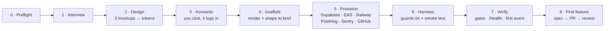

<div align="center">

# 📦 App in a Box

**Go from an app idea to a production-grade mobile app repo in about an hour.**
**Works in Claude Code and Codex.**

[Quickstart](#quickstart) · [What you get](#what-you-get) · [How it works](#how-it-works) · [Example](#example-lonely-socks) · [Status](#status--roadmap) · [FAQ](#faq)

   

</div>

---

Standing up a *real* app from scratch is mostly plumbing. You need auth, a database
with row-level security, an API, analytics, crash reporting, CI, a design system,
environment variables for three deploy targets, and a way to make your coding agent
behave like a disciplined team instead of a very fast intern.

App in a Box does that plumbing for you, then gets out of the way. You describe your
idea. It asks you about a dozen questions, shows you three design directions and
walks you through a few "Continue with GitHub" signups. Then it scaffolds, provisions
and wires everything, and hands you a repo where your agent builds features through a
spec → tests → PR → review loop.

It's the operating system behind [Forge](https://github.com/foxinthehenhouse/forge),
an AI strength-coaching app, with the Forge-specific parts taken out.

## Quickstart

Open an **empty folder**, then pick your agent.

### Claude Code

```
/plugin marketplace add foxinthehenhouse/app-in-a-box
```

```
/plugin install app-in-a-box@app-in-a-box
```

```
/app-in-a-box:new-app
```

### Codex

```
codex plugin marketplace add foxinthehenhouse/app-in-a-box
```

```
codex plugin add app-in-a-box@app-in-a-box
```

```
codex -c sandbox_workspace_write.network_access=true "Use \$new-app to build my app idea here."
```

### Any other agent (no plugin)

Clone this repo and paste this prompt into any agent that can read files and run a shell:

```
Read <clone>/plugins/app-in-a-box/skills/new-app/SKILL.md and follow it
exactly. KIT is <clone>/plugins/app-in-a-box. Build my app in the current folder.
```

> **Fewer approval prompts:** run `claude --permission-mode auto`, or
> `codex --approve-for-me`. For full bypass, use the bundled dev container. See
> [permissions](plugins/app-in-a-box/docs/PERMISSIONS.md).

Full walkthrough: **[START_HERE.md](START_HERE.md)**.

## What you get

A repo that's ready to ship on day one, not a starter you'll spend a week hardening.

| | |
|---|---|
| **📱 Mobile app** | Expo Router native tabs (Liquid Glass on iOS 26, Material 3 on Android) and form-sheet routes, email-code sign-in behind an auth gate, light + dark themes from your tokens, and a component library with a dev-only gallery. Production pieces are built in and tested: offline-first data (TanStack Query, queued edits), push client, deep links through one resolver, OTA updates, react-hook-form + zod forms, i18n with a pseudo-locale test, account deletion and "Download my data". PostHog analytics (typed events, masked replay, opt-out) and Sentry. A demo mode runs the whole app with no accounts. |
| **⚙️ Backend** | FastAPI with Supabase JWT auth (JWKS). A `/health` that names every unconfigured feature instead of failing silently, error ids on every 500, PII-scrubbed Sentry, and an example resource that's correctly scoped to the user, with ownership tests. |
| **🗄️ Database** | Supabase Postgres migrations with row-level security on every table, a profile-on-signup trigger, and a keep-alive for the free tier. |
| **🎨 Design** | Three rendered design directions of *your* core screen. The one you pick becomes `design/tokens.json`, and a WCAG contrast gate rejects unreadable palettes before any code exists. |
| **🛡️ Guards** | Git hooks that bind every agent and human: no commits on `main`, no staged `.env`, no key-shaped strings, gates before push. Mobile guard scripts: every screen instrumented, every env var wired for shipping builds, replay never unmasked. |
| **🔁 CI/CD** | Backend (ruff + pyright + pytest), mobile (tsc + eslint + guards + jest), migrations + RLS tested with pgTAP on a throwaway Postgres (Supabase Branching opt-in), gitleaks + CodeQL, workflow lint (actionlint + zizmor) and harness lint for prompts/hooks, AI PR review (Claude or Codex), EAS build/OTA workflows, scheduled jobs behind a secret, and a Supabase keep-alive. |
| **🤖 Agent harness** | `AGENTS.md` (Claude reads it via `CLAUDE.md`). 12 skills: backlog, next, feature-discovery, build-feature, pr-review, new-worktree, ship, north-star-report, routines, reflect, harness-optimize, harness-check. 10 subagent roles on routed models, with a `chair` for irreversible calls. Path rules that inject when you touch migrations, API contracts or screens. A git-tracked memory vault. |
| **🧠 Self-learning loop** | Every tool call is captured. `reflect` turns corrections into memory, and a pattern extractor mines transcripts for repeated failures. `harness-optimize` then proposes harness changes as a PR, with a protected-components manifest and a sunset protocol. |

### One harness, two agents

Everything agent-facing lives in one neutral place. The Claude and Codex folders are
generated from it, so the two never drift.

| | Source of truth | Claude Code | Codex |
|---|---|---|---|
| Instructions | `AGENTS.md` | `CLAUDE.md` → `@AGENTS.md` | native |
| Skills | `.agents/skills/` | `.claude/skills` (symlink) · `/name` | native · `$name` |
| Subagents | `.agents/agents/*.md` | `.claude/agents` (symlink) | `.codex/agents/*.toml` |
| MCP servers | `.mcp.json` | native | `.codex/config.toml` |
| Hooks | `.claude/hooks/*` | `.claude/settings.json` | `.codex/hooks.json` |
| Hard guards | `.githooks/` | ✓ | ✓ |

## How it works



| Phase | Your agent does | You do |
|---|---|---|
| 0 Preflight | Checks and installs git, Node, Python 3.12 and the service CLIs | Approve installs |
| 1 Interview | ~12 questions → `docs/product/BRIEF.md` + `appbox.yaml` | Answer |
| 2 Design | Renders 3 directions of your core screen, then writes contrast-checked tokens | Pick one |
| 3 Accounts | Opens each free service's signup, then logs in the CLIs | Click "Continue with GitHub" ~6× |
| 4 Scaffold | Creates the Expo app, overlays the template, and shapes the data model, API and screens to your brief | Nothing |
| 5 Provision | Creates cloud resources idempotently and wires every secret (never into git) | Nothing |
| 6 Harness | Turns on the git guards, branch protection and AI review, then proves each guard fires | Trust the project in Codex |
| 7 Verify | All gates green, `/health`, first PR, first analytics event and first error | Open the app on your phone |
| 8 First feature | Seeds a backlog and builds feature #1 through the full loop | Review the PR |

Stop at any phase. Progress lives in `appbox.yaml`, and re-running `new-app` resumes
where you left off.

### Accounts

Every service has a free tier, except Apple ($99/yr, and only when you ship to
TestFlight). The kit deliberately **never creates accounts for you**, because signups
need your consent, email verification and often a CAPTCHA. It automates everything
*after* the account exists.

GitHub · Supabase · Expo/EAS · Railway (about $5/mo after the trial) · PostHog ·
Sentry · optionally Linear, Anthropic/OpenAI · Apple Developer.

## Example: Lonely Socks

The kit was dogfooded end to end on a deliberately silly idea: an app for logging
single socks and celebrating when you reunite a pair.

- [`examples/lonely-socks/BRIEF.md`](examples/lonely-socks/BRIEF.md) is the one-page
  brief the interview produced.
- [`examples/lonely-socks/directions.html`](examples/lonely-socks/directions.html) is
  the three design directions (Playful won).
- [`examples/lonely-socks/tokens.json`](examples/lonely-socks/tokens.json) is the
  chosen palette. The contrast gate rejected the first draft (4.20:1).
- [`examples/lonely-socks/1-undo-reunion.md`](examples/lonely-socks/1-undo-reunion.md)
  is the first feature spec, built tests-first, then reviewed by the kit's own
  correctness-reviewer role.

That run found five bugs in the kit (a ruff default change, light-theme typing, a
React purity lint, phantom `/health` features, and preflight strictness). All five are
fixed and pinned by regression checks.

## Repository layout

```
.claude-plugin/marketplace.json      marketplace: read by Claude Code AND Codex
plugins/app-in-a-box/
  .claude-plugin/plugin.json         Claude Code manifest
  .codex-plugin/plugin.json          Codex manifest (same skills/)
  .mcp.json                          MCP servers used while provisioning
  skills/                            the 9 phases: new-app (start here), doctor,
                                     interview, design-directions, accounts,
                                     scaffold, provision, harness, first-feature
  scripts/render.py                  deterministic renderer + Claude/Codex adapter generator
  scripts/check_contrast.py          WCAG gate for design/tokens.json
  scripts/doctor.sh                  tools / logins / gates health check
  template/                          everything that lands in your new repo
  docs/                              PERMISSIONS.md, SOCIAL_AUTH.md
examples/lonely-socks/               a full dogfood run's outputs
scripts/selftest.sh                  proves the kit works (see below)
```

## Verify it yourself

```
scripts/selftest.sh
```

The selftest renders the template into a temp folder and runs 100+ checks. For each
guard, it plants a violation to prove the guard can actually fail:

- placeholders are all replaced, and the generated TOML/JSON adapters are valid
- the contrast gate catches a dim ink
- backend pytest and ruff pass, and the ownership test fails when user scoping is
  removed
- the git hooks refuse commit-on-main, a staged `.env` and key-shaped strings
- the Claude and Codex hooks run

Add `--mobile` for a real `create-expo-app` + overlay + `npm run gates` run (about
3 minutes). In that run, a planted hex colour, an uninstrumented screen and an unwired
env var must each fail.

## Status & roadmap

**Alpha (v0.1).** The code-shaped parts are verified: the renderer, a real Expo
SDK 57 build, the backend, the guards, the hooks and the review loop. Not yet verified:
provisioning against real accounts, the app running on a device, and a marketplace
install in each agent.

| Release | Focus |
|---|---|
| **v0.2 Polish** | Native tabs, SF/Material icons, haptics, a Reanimated 4 motion system, light and dark themes, a component library (skeleton, toast, sheet, empty state, celebration), splash/icon pipeline, and a no-accounts demo mode |
| **v0.3 Trust** | Harness linting (skills, AGENTS.md size, manifest, JSON schemas, `claude plugin validate`), workflow linting (actionlint, zizmor), gitleaks, pgTAP row-level security tests, a wire-contract test, and the kit's own CI |
| **v0.4 Self-driving** | Per-role models and effort, Claude Code Workflows for build and review, scheduled Routines, skill evals (`claude plugin eval`), and a `next` loop that picks the next ticket from your backlog and analytics |
| **v1.0 Production** | Offline data, push, deep links, OTA updates and rollback, EAS preview builds per PR, TestFlight submission, and a second dogfood with real cloud accounts |

## FAQ

**Is it free?**
The kit is MIT-licensed. The services have free tiers, except Railway (about $5/mo
after its trial) and Apple's developer program ($99/yr, only needed for TestFlight).
Railway is the one recurring cost; Fly.io and Render work the same way.

**Why not let the agent sign up for the services?**
Signups need you to accept terms and verify an email, and creating accounts in
someone's name is a line the kit won't cross. Everything after signup is automated.

**Will it put my API keys in git?**
No. Secrets go to `.env` (gitignored), GitHub secrets, EAS env and Railway variables.
The pre-commit hook blocks staged `.env` files and key-shaped strings, CI scans too,
and the Claude settings deny the agent reading `.env` into its context.

**Can I use a different stack?**
Not in v1. The stack is deliberately opinionated (Expo + FastAPI + Supabase) so every
guard, rule and skill can be specific. Swapping the backend host (Railway, Fly,
or Render) is supported. A Supabase-only stack is not in v1.

**Does it add AI to my app?**
Only if you say so in the interview. When it does, the model is fenced into one
backend module and the rest of the logic stays deterministic.

**Claude Code or Codex: which is better here?**
Both run the same skills. Claude Code gets auto-injected path rules and memory
recall through its hooks. Codex gets the same content through `AGENTS.md` and its own
hook system, which asks you to trust each hook once.

## Contributing

Issues and PRs are welcome. Run `scripts/selftest.sh` before opening a PR. If you
change the template, add a check to the selftest that fails without your change.

## License

[MIT](LICENSE) © 2026 Kyle Fox
